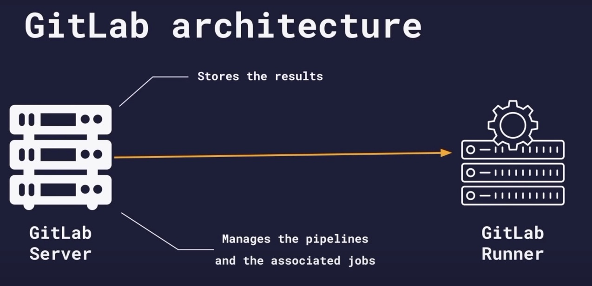
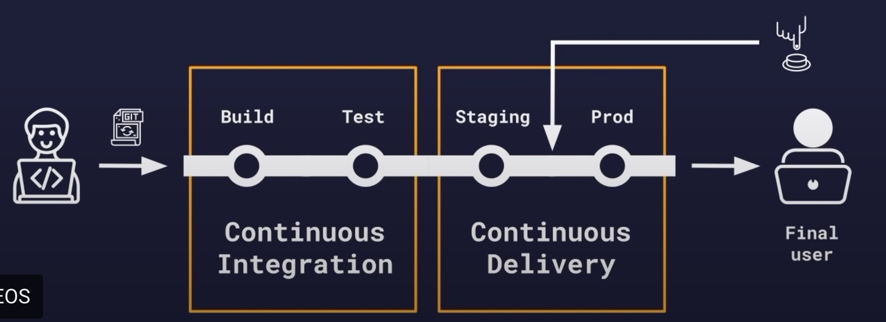

Deployment

AWS

- cloud platform provider
- payg for renting cloud infrastucture, for computation or data storage

s3

- like dropbox
- store the public files and serve them
- buckets -> store "objects"

AWS CLI (command line interface)

- in order to use the aws cli within our pipeline, we need a docker image with the AWS CLI preloaded

```
deployto s3:
    stage: deploy
    image:
        name: amazon/aws-cli:2.4.11
        entrypoint: [""] // image uses an entry point (already a program running when start the image). We need to override this
    script:
        - aws --version  // will print out the aws version
```

Uploading a file to S3

This wont work because we don't have credentials

```
deployto s3:
    stage: deploy
    image:
        name: amazon/aws-cli:2.4.11
        entrypoint: [""]
    script:
        - aws --version
        - echo "hello s3" > text.txt
        - aws s3 cp text.txt s3://warren-20220519/text.txt
```

Masking & protecting variables

- can use gitlab variables to store variables
- `settings => CI/CD => variables`
- add variable
- two flags
  - protect variables. if enabled, the variable will only be available to protected branches. Not for feature branches (merge requests). If you have a test and prod variables, you might have different variables. Keep protected var for prod. Ensure cannot dpeloy to prod from different branch. if disables, available to all branches.
  - mask variable. accidently print a variable - will show as \*\*, for example.

```
deployto s3:
stage: deploy
image:
    name: amazon/aws-cli:2.4.11
    entrypoint: [""]
script:
    - aws --version
    - echo "hello s3" > text.txt
    - aws s3 cp text.txt s3://$AWS_S£_BUCKET/text.txt   // AWS_S£_BUCKET has been stored as variable in gitlab => s3 => variables
```

Identity management with AWS IAM

- we have to provide credentials to AWS
- need to limit to just s3
- 'IAM' services - an identity management service
- need to create a user that can access s3
- 'new user' => select access key. This is a programmatic access for CLI, SDK
- permissions, can select a predefined policy
- AWS creates an 'access key ID' and a 'secret access key'. like username and password
- then add the following to the gitlab ci/cd variables
  - AWS_ACCESS_KEY_ID
  - AWS_DEFAULT_REGION
  - AWS_S3_BUCKET
  - AWS_SECRET_ACCESS_KEY
- these variables are automatically picked up by the job

Uploading multiple files to S3

- aws cli `sync` command will sync two given directories

```
deployto s3:
    stage: deploy
    image:
        name: amazon/aws-cli:2.4.11
        entrypoint: [""]
    script:
        - aws --version
        - aws s3 sync build s3://$AWS_S3_BUCKET -- delete // deletes files that are not in the source
```

Hosting a website on S3

- buckets are default private
- enable static hosting website in `properties`
- permissions -> enable public access
- bucket policy -> a few things need to be set here.

Controlling When a job runs

- we don't all merge requests to deploy to production
- below will mean that if the branhc is not the default branch, then it will no deploy

```
deployto s3:
    stage: deploy
    image:
        name: amazon/aws-cli:2.4.11
        entrypoint: [""]
    rules: // if true, the job will run
        - if: $CI_COMMIT_REF_NAME == $CI_DEFAULT_BRANCH   // $CI_COMMIT_REF_NAME predefined variable that is dynamically created
    script:
        - aws --version
        - aws s3 sync build s3://$AWS_S3_BUCKET --delete
```

Post deployment testing

```
production tests:
    stage: post deploy
    image: curlimages/curl
    rules:
        - if: $CI_COMMIT_REF_NAME == $CI_DEFAULT_BRANCH
    script:
        - curl $APP_BASE_URL | grep "React App" // checks whether the URL has the text

```

What is CI/CD

- continuos integration - all our stages pass for any branch (unit tests, build)
- continuous delivery/deployment - we cant deploy straight to production - need a staging environment.
- pre-prod - try it out here before it goes to prod

- continuous delivery - goes to staging, and then we activate before going to prod




```
stages:
    - build
    - test
    - deploy staging
    - test staging
    - deploy production
    - test production

variables:
    APP_BASE_URL: http://warren-20220519.s3-website.us-east-2.amazonaws.com
    APP_BASE_URL_STAGING: http://warren-20220519-staging.s3-website.eu-west-2.amazonaws.com

build website:
    image: node:16-alpine
    stage: build
    script:
        - yarn install
        - yarn lint
        - yarn test
        - yarn build
    artifacts:
        paths:
            - build

test website:
    image: node:16-alpine
    stage: test
    script:
        - yarn global add serve
        - apk add curl
        - serve -s build &
        - sleep 10
        - curl http://localhost:3000 | grep "React App"


// deploy to staging environment and test staging before production
deploy to to staging:
    stage: deploy staging
    image:
        name: amazon/aws-cli:2.4.11
        entrypoint: [""]
    rules:
        - if: $CI_COMMIT_REF_NAME == $CI_DEFAULT_BRANCH
    script:
        - aws --version
        - aws s3 sync build s3://$AWS_S3_BUCKET_STAGING --delete

staging tests:
    stage: test staging
    image: curlimages/curl
    rules:
        - if: $CI_COMMIT_REF_NAME == $CI_DEFAULT_BRANCH
    script:
        - curl $APP_BASE_URL | grep "React App"

deploy to to production:
    stage: deploy production
    image:
        name: amazon/aws-cli:2.4.11
        entrypoint: [""]
    rules:
        - if: $CI_COMMIT_REF_NAME == $CI_DEFAULT_BRANCH
    script:
        - aws --version
        - aws s3 sync build s3://$AWS_S3_BUCKET --delete

production tests:
    stage: test production
    image: curlimages/curl
    rules:
        - if: $CI_COMMIT_REF_NAME == $CI_DEFAULT_BRANCH
    script:
        - curl $APP_BASE_URL | grep "React App"
```

Environments

- we have two environments (stagin and prod)
- gitlab => deployments => environments
- what is an environment? staging is an env, prod is an env. whereever we are deploying something, that is an env.
- makes sense to have them defined somewhere

- environments => make new => "production"
- environments => make new => "staging"

- in gitlab variables, we can then update the "environment scope" to the environment, and also protect it.
- same for staging. the staging and prod can also share the same name, but have different environments.

```
deploy to to staging:
    stage: deploy staging
    environment: staging   // important
    image:
        name: amazon/aws-cli:2.4.11
        entrypoint: [""]
    rules:
        - if: $CI_COMMIT_REF_NAME == $CI_DEFAULT_BRANCH
    script:
        - aws --version
        - aws s3 sync build s3://$AWS_S3_BUCKET --delete
        - curl $CI_ENVIRONMENT_URL | grep "React App"

deploy to to production:
    stage: deploy production
    environment: production // important
    image:
        name: amazon/aws-cli:2.4.11
        entrypoint: [""]
    rules:
        - if: $CI_COMMIT_REF_NAME == $CI_DEFAULT_BRANCH
    script:
        - aws --version
        - aws s3 sync build s3://$AWS_S3_BUCKET --delete
        - curl $CI_ENVIRONMENT_URL | grep "React App"
```

Reusing a job configuration

- we can reuse a configuration for a job

```
.deploy:
    image:
        name: amazon/aws-cli:2.4.11
        entrypoint: [""]
    rules:
        - if: $CI_COMMIT_REF_NAME == $CI_DEFAULT_BRANCH
    script:
        - aws --version
        - aws s3 sync build s3://$AWS_S3_BUCKET --delete
        - curl $CI_ENVIRONMENT_URL | grep "React App"deploy to to staging:

deploy to to staging:
    stage: deploy staging
    environment: staging
    extends: .deploy   // reused here

deploy to to production:
    stage: deploy production
    environment: production
    extends: .deploy // reused here
```

- testing the website.
- we can add the job number to the website and test that.

```
stages:
    - build
    - test
    - deploy staging
    - deploy production

variables:
    APP_VERSION: $CI_PIPELINE_IID   // this is a unique id for the job

build website:
    image: node:16-alpine
    stage: build
    script:
        - yarn install
        - yarn lint
        - yarn test
        - yarn build
        - echo $APP_VERSION > build/version.html  // added to the website here
    artifacts:
        paths:
            - build

test website:
    image: node:16-alpine
    stage: test
    script:
        - yarn global add serve
        - apk add curl
        - serve -s build &
        - sleep 10
        - curl http://localhost:3000 | grep "React App"

.deploy:
    image:
        name: amazon/aws-cli:2.4.11
        entrypoint: [""]
    rules:
        - if: $CI_COMMIT_REF_NAME == $CI_DEFAULT_BRANCH
    script:
        - aws --version
        - aws s3 sync build s3://$AWS_S3_BUCKET --delete
        - curl $CI_ENVIRONMENT_URL | grep "React App"
        - curl $CI_ENVIRONMENT_URL/version.html | grep $APP_VERSION   // checked here

deploy to to staging:
    stage: deploy staging
    environment: staging
    extends: .deploy

deploy to to production:
    stage: deploy production
    environment: production
    extends: .deploy
```

Continuous Delivery Pipeline
